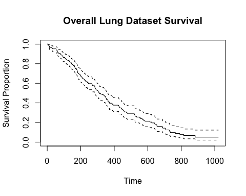
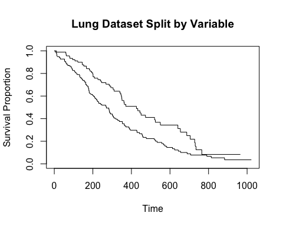
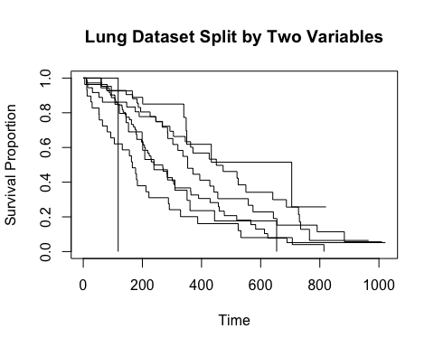
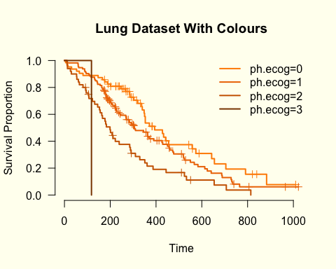

## A Univariable Look at Time-to-Event Data

### Time waits for no-one.
In clinical research (among other fields) there is often keen interest in **survival data**, how long it takes for an event to happen (ie. death or disease progression), and how it can be affected by other variables. In this entry we'll look at how you can **structure** the data, **visualise** it, and apply a **statistical test** to help draw a conclusion from it. 

This article is for beginners with R, and it doesn’t matter if you’re a student or a professional. To follow along, you'll need an installation of R (although we generally advise using RStudio as well!), although you will need to install one external package of code (this is easy). Hopefully, you can follow along and simply run the code chunks below for yourself - and go on to perform similar analyses on your own data. 

Check our other articles for more R!

# 0. Install the Survival Package

* We need to use the `survival` package (also known as a library).
* It's super easy to install (most) packages.
* A package is a bundle of code and data that has been been published online and is freely accessible. 
* You only need to install it once - using the following line of code.


```r
#install.packages("survival") # this should install survival - it'll ask you what source to use as well
```

Once a package is loaded, you have to load it into your R session - using the `library()` function.


```r
library(survival) # this function loads an installed package
```

# 1. Examine the Data

* The survival package comes with some data we can use - no need to import anything.
* Alternatively, you could read some data from somewhere else; see our other articles for tips with this!

### The Lung Dataset


```r
data(lung) # load the data
```

```
## Warning in data(lung): data set 'lung' not found
```

```r
str(lung) # and look at the structure of it
```

```
## 'data.frame':	228 obs. of  10 variables:
##  $ inst     : num  3 3 3 5 1 12 7 11 1 7 ...
##  $ time     : num  306 455 1010 210 883 ...
##  $ status   : num  2 2 1 2 2 1 2 2 2 2 ...
##  $ age      : num  74 68 56 57 60 74 68 71 53 61 ...
##  $ sex      : num  1 1 1 1 1 1 2 2 1 1 ...
##  $ ph.ecog  : num  1 0 0 1 0 1 2 2 1 2 ...
##  $ ph.karno : num  90 90 90 90 100 50 70 60 70 70 ...
##  $ pat.karno: num  100 90 90 60 90 80 60 80 80 70 ...
##  $ meal.cal : num  1175 1225 NA 1150 NA ...
##  $ wt.loss  : num  NA 15 15 11 0 0 10 1 16 34 ...
```
We can see that this is a `data.frame` object, with a number of data columns.
The key columns for survival analysis are:

* A column for time - this could be overall survival or time to disease progression. Here it's listed as '*time*', and it's numeric. 
* A column for censoring status - whether or not the *event* happened (ie. death, disease progression, etc) or the individual dropped out for another reason (ie. left study, lost to followup, survived until the end of the study, etc). Here the column is called '*status*'.

There are also some other descriptive columns - institute ID, performance scores (overall health indicators), weight loss over the last 6 months. We'll talk about them later.

More details can be found here: https://stat.ethz.ch/R-manual/R-devel/library/survival/html/lung.html

A brief note about the **censor** column, the convention here is that:

* 0 = censored, 1 = event
* or alternatively, 1 = censored, 2 = event

For the `lung` data above it's already in a good format - but if you load your own data in you'll need to customise it to fit one of these styles (0/1 or 1/2). 

# 2. Calculate Survival

We can use a couple of handy functions from `survival` to take a look at the data and make some summaries. An important function to use will be `Surv()`.


```r
lungsurvival = Surv(lung$time,lung$status) # make a survival time object
head(lungsurvival) # take a look at the first 5 elements
```

```
## [1]  306   455  1010+  210   883  1022+
```

The object we made here is essentially a vector of survival times, with `+` symbols appended to show when censoring has taken place. We will use this going forward. 

### Fitting the Data

The `survfit()` function is a key element of the survival package, and it fits survival curves to our data. We can have a quick go as follows.

```r
survfit(formula = lungsurvival ~ 1) # make the simplest survival curve object
```

```
## Call: survfit(formula = lungsurvival ~ 1)
## 
##        n events median 0.95LCL 0.95UCL
## [1,] 228    165    310     285     363
```
This is another formula interface function - see our other articles. We're telling `survfit()` to fit a survival curve (more on these later) to the data (the `lungsurvival` object we made), and we can tell it to use the whole dataset by simply including a `1` in the formula. This call outputs:

* The number of entries and the number of events in the dataset.
* Summary statistics - the **median survival**, along with the **95% confidence interval**.

For the record, we can also do this: `survfit(formula = Surv(time,status) ~ 1,data=lung)` - note the modified syntax with the data parameter.

We can look more closely at how the survival proportion over time by using the `summary()` function. For convenience we can save the fit to a variable called `lungfit`.


```r
lungfit = survfit(formula = lungsurvival ~ 1) # save the fit 
summary(lungfit, times = c(0,100,200,500,1000)) # we can specify whatever times we like
```

```
## Call: survfit(formula = lungsurvival ~ 1)
## 
##  time n.risk n.event survival std.err lower 95% CI upper 95% CI
##     0    228       0   1.0000  0.0000       1.0000        1.000
##   100    196      31   0.8640  0.0227       0.8206        0.910
##   200    144      41   0.6803  0.0311       0.6219        0.744
##   500     41      66   0.2933  0.0351       0.2320        0.371
##  1000      2      27   0.0503  0.0228       0.0207        0.123
```
Nice. This sort of information is frequently used in **risk tables**. What we are calculating using these functions is called the *'Kaplan-Meier estimator'*, a non-parametric way to estimate survival probabilities over time. 

We can also convert these data into a simple plot: the `survival` package contains instructions to tell the basic R `plot()` function how to plot it.


```r
plot(survfit(formula = lungsurvival ~ 1, data=lung), 
     ylab = "Survival Proportion", 
     xlab = "Time",
     main = "Overall Lung Dataset Survival")
```



Ok, looking plausible. This is often called a **Kaplan-Meier Curve** (or Kaplan-Meier Plot). 

### Stratify by a Variable

There are multiple variables in the `lung` data set. We can explore them with a modified call to `survfit`, substituting the `1` with the name of the variable, and including a *data* argument to tell the function where to find it. 


```r
survfit(formula = lungsurvival ~ sex, data=lung) # performance status of individuals
```

```
## Call: survfit(formula = lungsurvival ~ sex, data = lung)
## 
##         n events median 0.95LCL 0.95UCL
## sex=1 138    112    270     212     310
## sex=2  90     53    426     348     550
```

This shows a breakdown of survival statistics (ie. median survival and confidence intervals) for **each level of the variable** in the data. Do these values look different? Can we observe a trend?


```r
plot(survfit(formula = lungsurvival ~ sex, data=lung), 
     ylab = "Survival Proportion", 
     xlab = "Time", 
     main = "Lung Dataset Split by Variable")
```



This approach works best for *categorical* variables (the `ph.ecog` variable would work well too); if we tried it with a *continuous* one it looks rather odd (`meal.cal`, for example). Try it out?

### Stratify by Multiple Variables

The `survfit()` function is clever - we can give it multiple variables at the same time and it calculates survival proportions for each combination of the variables. 


```r
survfit(formula = lungsurvival ~ sex + ph.ecog, data=lung) # performance status of individuals
```

```
## Call: survfit(formula = lungsurvival ~ sex + ph.ecog, data = lung)
## 
##    1 observation deleted due to missingness 
##                   n events median 0.95LCL 0.95UCL
## sex=1, ph.ecog=0 36     28    353     303     558
## sex=1, ph.ecog=1 71     54    239     207     363
## sex=1, ph.ecog=2 29     28    166     105     288
## sex=1, ph.ecog=3  1      1    118      NA      NA
## sex=2, ph.ecog=0 27      9    705     350      NA
## sex=2, ph.ecog=1 42     28    450     345     687
## sex=2, ph.ecog=2 21     16    239     199     444
```

We can see that the different levels of these variables are shown in the output - and that the usage of `summary()` (like above) will show a detailed output.


```r
plot(survfit(formula = lungsurvival ~ sex + ph.ecog, data=lung), 
     ylab = "Survival Proportion", 
     xlab = "Time", 
     main = "Lung Dataset Split by Two Variables")
```


These plots are a bit bland. We can improve them a little.

# 3. Tweaking the Plots

We can add colours and a legend to the lines in these plots. Colours are assigned by the levels of the variable, as can be seen in the `survfit()` call. Here we'll look at the **ECOG performance status** variable - which has four levels. 


```r
survfit(formula = lungsurvival ~ ph.ecog, data=lung)
```

```
## Call: survfit(formula = lungsurvival ~ ph.ecog, data = lung)
## 
##    1 observation deleted due to missingness 
##             n events median 0.95LCL 0.95UCL
## ph.ecog=0  63     37    394     348     574
## ph.ecog=1 113     82    306     268     429
## ph.ecog=2  50     44    199     156     288
## ph.ecog=3   1      1    118      NA      NA
```

```r
lungfit = survfit(formula = lungsurvival ~ ph.ecog, data=lung) # make an object for the fit
```

We can use this to plot with.


```r
oldpar = par(no.readonly = TRUE) # make a copy of the default graphical parameters
par(bg = "ivory") # this lets us specify an overall background colour


plot(lungfit, # plot this using 'plot' 
     ylab = "Survival Proportion", 
     xlab = "Time", 
     main = "Lung Dataset With Colours",
     mark.time = T, # include little tick marks to indicate when censoring happens
     lwd = 2, # increase the line thickness
     col = c("darkorange","darkorange2","darkorange3","darkorange4"), # add colours in the order we want
     bty = "n", # remove the border
     las = 1) # adjust the angle of the axis numbers

legend("topright", # you can feed in x-y coordinates, or just a keyword
       legend = names(lungfit$strata), # give it the unique levels
       col=c("darkorange","darkorange2","darkorange3","darkorange4"), # colours in the same order
       bg = NA, # remove the background colour
       lty=1, # add a line to the legend
       lwd=2, # thicker line
       box.lty=0) # remove legend border
```



```r
par(oldpar)
```
Changing various elements is pretty straightforward - and in this case we can see that there's a reduction in survival as the value for `ph.ecog` increases. As this value relates to an overall measurement of how healthy a patient is, this makes sense. 

# 4. Do a Statistical Test

To continue exploring these data, we can perform an appropriate statistical test to compare the survival distributions of these curves, with a **null hypothesis** that the the groups have no difference. We aren't diving deep into this topic here, and there are many other resources to learn more about this. 

The `survdiff()` function is straightforward to use, with the same syntax as the `survfit()` function we used earlier. This performs a *log-rank test*.


```r
survdiff(formula = lungsurvival ~ sex, data=lung) # survdiff!
```

```
## Call:
## survdiff(formula = lungsurvival ~ sex, data = lung)
## 
##         N Observed Expected (O-E)^2/E (O-E)^2/V
## sex=1 138      112     91.6      4.55      10.3
## sex=2  90       53     73.4      5.68      10.3
## 
##  Chisq= 10.3  on 1 degrees of freedom, p= 0.001
```
It reports here a p-value, but we can also extract it as a variable. It's not very intuitive, but...


```r
my_survtest = survdiff(formula = lungsurvival ~ sex, data=lung) # save the test results
my_survdf = length(my_survtest$obs) - 1 # how many degrees of freedom 
my_survpvalue = 1 - pchisq(q = my_survtest$chisq,df = my_survdf) # perform the test ourselves and get the p
my_survpvalue_formatted = format.pval(my_survpvalue,digits = 1) # format it
paste("My p-value is",my_survpvalue_formatted)
```

```
## [1] "My p-value is 0.001"
```


We can apply this test to a variable that has more than two groups - like `ph.ecog` (which has four levels), and it generates a p-value, but it doesn't explicitly tell use which groups are different to each other, just that *overall* there is a difference. It's a starting point, but for complicated survival data with multiple variables we may need more than a simple log-rank test...


```r
survdiff(formula = lungsurvival ~ ph.ecog, data=lung) # different variable to above
```

```
## Call:
## survdiff(formula = lungsurvival ~ ph.ecog, data = lung)
## 
## n=227, 1 observation deleted due to missingness.
## 
##             N Observed Expected (O-E)^2/E (O-E)^2/V
## ph.ecog=0  63       37   54.153    5.4331    8.2119
## ph.ecog=1 113       82   83.528    0.0279    0.0573
## ph.ecog=2  50       44   26.147   12.1893   14.6491
## ph.ecog=3   1        1    0.172    3.9733    4.0040
## 
##  Chisq= 22  on 3 degrees of freedom, p= 7e-05
```

```r
ecog_p = survdiff(formula = lungsurvival ~ ph.ecog, data=lung)
```
We can (of course) add this to our plot.


```r
oldpar = par(no.readonly = TRUE) # make a copy of the default graphical parameters
par(bg = "ivory") # this lets us specify an overall background colour


plot(lungfit, # plot this using 'plot' 
     ylab = "Survival Proportion", 
     xlab = "Time", 
     main = "Lung Dataset With Colours",
     mark.time = T, # include little tick marks to indicate when censoring happens
     lwd = 2, # increase the line thickness
     col = c("darkorange","darkorange2","darkorange3","darkorange4"), # add colours in the order we want
     bty = "n", # remove the border
     las = 1) # adjust the angle of the axis numbers

legend("topright", # you can feed in x-y coordinates, or just a keyword
       legend = names(lungfit$strata), # give it the unique levels
       col=c("darkorange","darkorange2","darkorange3","darkorange4"), # colours in the same order
       bg = NA, # remove the background colour
       lty=1, # add a line to the legend
       lwd=2, # thicker line
       box.lty=0) # remove legend border
```


```r
par(oldpar)
```


# 5. Final Thoughts

This article is really just a start to performing survival analysis, and there's certainly more to cover.
The key elements to remember are as follows:

- To estimate **survival probabilities** over time, you need *time* and *censoring status* data.
- The `survival` package is the core library for this type of analysis in R.
- It allows you to collate **summary statistics** about your overall population, and about subgroups. 
- You can plot **survival curves** (Kaplan-Meier plots) to visualise these.
- A **statistical test** like the log-rank test can help us draw conclusions from the data.
