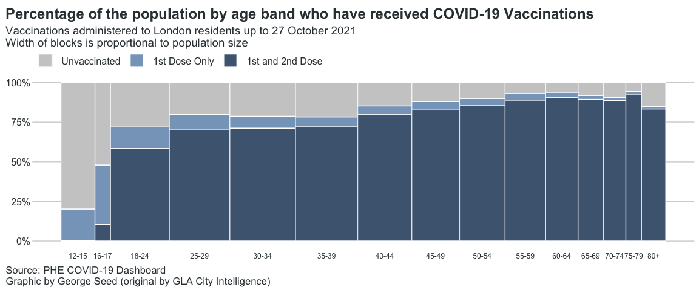
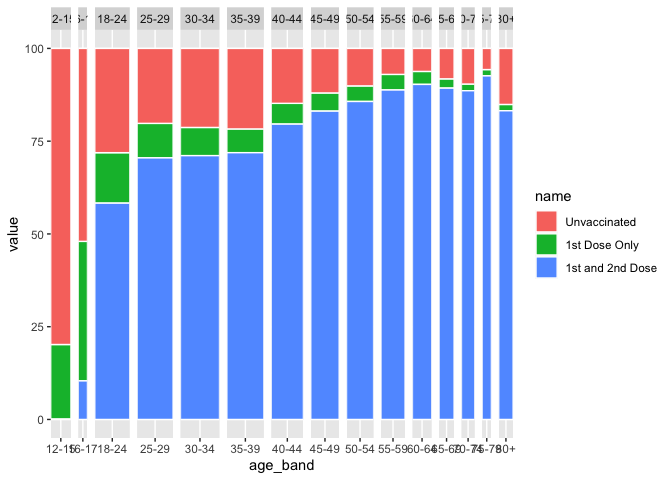
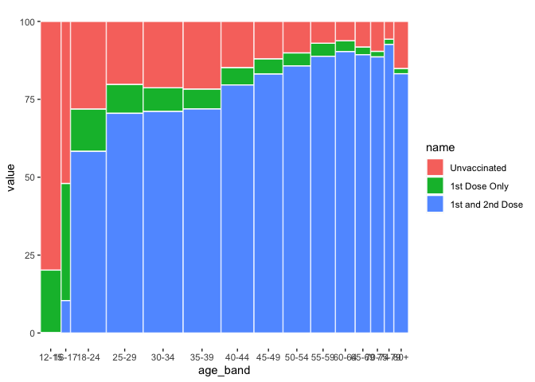
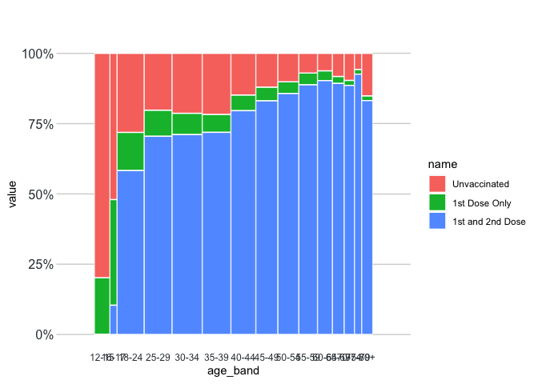
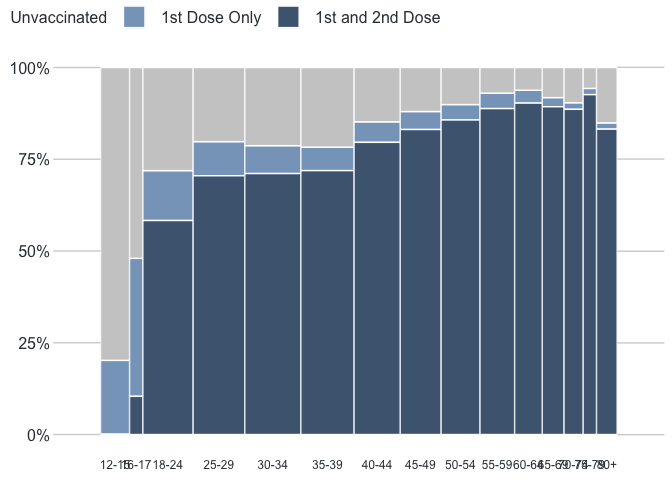
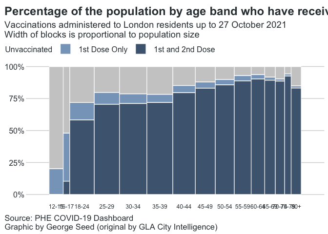

## Or: I knew that graph looked familiar.

### I guess I just like graphs.

There's some *lovely* data out there these days - exiting, big data collected by diligent people and transformed into genuinely important, influential analysis that has serious consequences. The Greater London Authority has a lot of it, and they're cool with people poking around in it themselves. There's a lot of data there to download and explore, or you can just check out their own visualisations.

They currently host a **great** page on COVID-19 epidemiology, containing longitudinal datasets on infections, vaccinations and hospital admissions, updated regularly (and rapidly), and with some top-quality visualisations to help us explore it. Relevant to my interests though, is that the whole page was produced using R, my preferred tool (toolbox?) for data analysis. It's a work of art: a diverse set of clear, readable plots, maintaining a consistent style throughout, and with a complicated set of input data to work from. There's even a clickable interactive element! Blimey. 

As soon as I saw it I proclaimed: *that's some mighty fine R there, you can tell by the pixels*, but my colleagues were not convinced. Surely some touch-ups in an image editor? Well, fine then, I guess we'll have to just... plot it.

# 0. Premise

This is the first entry in my *Forensic Plotting* series, in which I try to arbitrarily copy a graph that I like (or don't like), as best as I can. It's not really a tutorial or anything - but I'll explain some things here and there. Further, I'm not going to claim best-practices for any of the code here; it will be more idiomatic and unusual, reflecting how I 'solved' reproducing the graph as best as I could. 

Here we will be looking at the London Vaccination Data - in particular this graph. [Show downloaded picture of data]

I like this graph - I think it's an intuitive look at the proportion of individuals who have received COVID-19 vaccines, illustrating the relative sizes of different population age bands.
It's also achievable through very few lines of code - exploiting some clever R libraries.


# 1. Get the Things we Need

I downloaded the file "phe_vaccines_age_london_boroughs.csv" using the following code, saving it to a variable named `vaccines`.


```r
vaccines = read.csv("https://data.london.gov.uk/download/coronavirus--covid-19--cases/ae4d5fc9-5448-49a6-810f-910f7cbc9fd2/phe_vaccines_age_london_boroughs.csv")
```
Most of the time `read.something` functions are used to open local files - but they can pull directly from the web, instead of downloading it manually first. 


```r
library(janitor)
library(dplyr)
library(tidyr)
library(ggplot2)
```


# 2. Edit the Data

Ok, so we can process this in a one-liner using some clever functions courtesy of the tidyverse package ecosystem.


```r
vaxdat = vaccines %>% group_by(age_band,dose) %>% filter(date == "2021-10-27") %>% summarise(totalpop = sum(population), prop_doses = round(100*(sum(cum_doses)/sum(population)),digits = 1)) %>% pivot_wider(id_cols = c(age_band,totalpop),names_from = dose,values_from = c("prop_doses")) %>% clean_names() %>% mutate(x1st_dose = x1st_dose - x2nd_dose, unvaxed = 100-(x1st_dose + x2nd_dose)) %>% rename(Unvaccinated = unvaxed, "1st Dose Only" = x1st_dose,  "1st and 2nd Dose" = x2nd_dose) %>% pivot_longer(!c(age_band,totalpop)) %>% mutate(name = factor(name, levels=c("Unvaccinated","1st Dose Only","1st and 2nd Dose")),age_band = gsub(age_band,pattern = " |years",replacement = "")) 
```

Easy, right? For the uninitiated, this code block uses *pipes* (the `%>%` things) to move data from one function to the next, without creating any intermediate files. 

# 3. Edit the Data More Readably

It's a *bit* unwieldy to chain so many functions together like this though (in my opinion), so to explain it a bit we can split up the processing into smaller chunks.


```r
vaxdat1 = vaccines %>% filter(date == "2021-10-27") %>% group_by(age_band,dose) 
head(vaxdat1)
```

<div data-pagedtable="false">
  <script data-pagedtable-source type="application/json">
{"columns":[{"label":["area_name"],"name":[1],"type":["chr"],"align":["left"]},{"label":["area_code"],"name":[2],"type":["chr"],"align":["left"]},{"label":["date"],"name":[3],"type":["chr"],"align":["left"]},{"label":["dose"],"name":[4],"type":["chr"],"align":["left"]},{"label":["age_band"],"name":[5],"type":["chr"],"align":["left"]},{"label":["age_higher"],"name":[6],"type":["int"],"align":["right"]},{"label":["age_lower"],"name":[7],"type":["int"],"align":["right"]},{"label":["cum_doses"],"name":[8],"type":["int"],"align":["right"]},{"label":["new_doses"],"name":[9],"type":["int"],"align":["right"]},{"label":["population"],"name":[10],"type":["int"],"align":["right"]},{"label":["new_prop"],"name":[11],"type":["dbl"],"align":["right"]},{"label":["cum_prop"],"name":[12],"type":["dbl"],"align":["right"]}],"data":[{"1":"Barking and Dagenham","2":"E09000002","3":"2021-10-27","4":"1st dose","5":"12 - 15 years","6":"15","7":"12","8":"738","9":"51","10":"13415","11":"0.0038017145","12":"0.05501305"},{"1":"Barking and Dagenham","2":"E09000002","3":"2021-10-27","4":"1st dose","5":"16 - 17 years","6":"17","7":"16","8":"2300","9":"12","10":"5541","11":"0.0021656741","12":"0.41508753"},{"1":"Barking and Dagenham","2":"E09000002","3":"2021-10-27","4":"1st dose","5":"18 - 24 years","6":"24","7":"18","8":"10867","9":"13","10":"17719","11":"0.0007336757","12":"0.61329646"},{"1":"Barking and Dagenham","2":"E09000002","3":"2021-10-27","4":"1st dose","5":"25 - 29 years","6":"29","7":"25","8":"9370","9":"11","10":"15880","11":"0.0006926952","12":"0.59005038"},{"1":"Barking and Dagenham","2":"E09000002","3":"2021-10-27","4":"1st dose","5":"30 - 34 years","6":"34","7":"30","8":"11675","9":"8","10":"17683","11":"0.0004524119","12":"0.66023865"},{"1":"Barking and Dagenham","2":"E09000002","3":"2021-10-27","4":"1st dose","5":"35 - 39 years","6":"39","7":"35","8":"13309","9":"6","10":"17445","11":"0.0003439381","12":"0.76291201"}],"options":{"columns":{"min":{},"max":[10]},"rows":{"min":[10],"max":[10]},"pages":{}}}
  </script>
</div>
Here are the first five rows.

Firstly, the vaccines dataset is big - and updated regularly - so here we `filter()` it for a specific day (I did the day that I downloaded it). We are going to subsequently explore the results for specific age bands and their vaccine dose information, hence the `group_by()` function.

The next block - more complicated now - calculates some summary metrics based on the previously assigned groups.


```r
vaxdat2 = vaxdat1 %>% summarise(totalpop = sum(population), prop_doses = round(100*(sum(cum_doses)/sum(population)),digits = 1))
head(vaxdat2)
```

<div data-pagedtable="false">
  <script data-pagedtable-source type="application/json">
{"columns":[{"label":["age_band"],"name":[1],"type":["chr"],"align":["left"]},{"label":["dose"],"name":[2],"type":["chr"],"align":["left"]},{"label":["totalpop"],"name":[3],"type":["int"],"align":["right"]},{"label":["prop_doses"],"name":[4],"type":["dbl"],"align":["right"]}],"data":[{"1":"12 - 15 years","2":"1st dose","3":"425353","4":"20.2"},{"1":"12 - 15 years","2":"2nd dose","3":"425353","4":"0.1"},{"1":"16 - 17 years","2":"1st dose","3":"194388","4":"48.0"},{"1":"16 - 17 years","2":"2nd dose","3":"194388","4":"10.4"},{"1":"18 - 24 years","2":"1st dose","3":"736340","4":"71.9"},{"1":"18 - 24 years","2":"2nd dose","3":"736340","4":"58.3"}],"options":{"columns":{"min":{},"max":[10]},"rows":{"min":[10],"max":[10]},"pages":{}}}
  </script>
</div>

Here we have the total population of each age band, along with the proportion who have had each dose. Note the duplicated values in the **totalpop** column - there are currently two lines for each age band, so that makes sense. This is classic *long-format* data. 

To make some subsequent tweaks to it, I found it helpful to reshape it into a *wide* format. 


```r
vaxdat3 = vaxdat2 %>% pivot_wider(id_cols = c(age_band,totalpop),names_from = dose,values_from = c("prop_doses")) %>% clean_names()
head(vaxdat3)
```

<div data-pagedtable="false">
  <script data-pagedtable-source type="application/json">
{"columns":[{"label":["age_band"],"name":[1],"type":["chr"],"align":["left"]},{"label":["totalpop"],"name":[2],"type":["int"],"align":["right"]},{"label":["x1st_dose"],"name":[3],"type":["dbl"],"align":["right"]},{"label":["x2nd_dose"],"name":[4],"type":["dbl"],"align":["right"]}],"data":[{"1":"12 - 15 years","2":"425353","3":"20.2","4":"0.1"},{"1":"16 - 17 years","2":"194388","3":"48.0","4":"10.4"},{"1":"18 - 24 years","2":"736340","3":"71.9","4":"58.3"},{"1":"25 - 29 years","2":"757848","3":"79.8","4":"70.5"},{"1":"30 - 34 years","2":"822084","3":"78.7","4":"71.1"},{"1":"35 - 39 years","2":"779934","3":"78.3","4":"71.9"}],"options":{"columns":{"min":{},"max":[10]},"rows":{"min":[10],"max":[10]},"pages":{}}}
  </script>
</div>

It's the same data as in the `vaxdat2` object, except rearranged. Now I want to edit the columns - calculating the proportion of people who have had a) only one dose and b) no doses at all, and sort out appropriate labels for these variables. 


```r
vaxdat4 = vaxdat3 %>% mutate(x1st_dose = x1st_dose - x2nd_dose, unvaxed = 100-(x1st_dose + x2nd_dose)) %>% rename(Unvaccinated = unvaxed, "1st Dose Only" = x1st_dose,  "1st and 2nd Dose" = x2nd_dose) 
head(vaxdat4)
```

<div data-pagedtable="false">
  <script data-pagedtable-source type="application/json">
{"columns":[{"label":["age_band"],"name":[1],"type":["chr"],"align":["left"]},{"label":["totalpop"],"name":[2],"type":["int"],"align":["right"]},{"label":["1st Dose Only"],"name":[3],"type":["dbl"],"align":["right"]},{"label":["1st and 2nd Dose"],"name":[4],"type":["dbl"],"align":["right"]},{"label":["Unvaccinated"],"name":[5],"type":["dbl"],"align":["right"]}],"data":[{"1":"12 - 15 years","2":"425353","3":"20.1","4":"0.1","5":"79.8"},{"1":"16 - 17 years","2":"194388","3":"37.6","4":"10.4","5":"52.0"},{"1":"18 - 24 years","2":"736340","3":"13.6","4":"58.3","5":"28.1"},{"1":"25 - 29 years","2":"757848","3":"9.3","4":"70.5","5":"20.2"},{"1":"30 - 34 years","2":"822084","3":"7.6","4":"71.1","5":"21.3"},{"1":"35 - 39 years","2":"779934","3":"6.4","4":"71.9","5":"21.7"}],"options":{"columns":{"min":{},"max":[10]},"rows":{"min":[10],"max":[10]},"pages":{}}}
  </script>
</div>

Getting close. A couple more final tweaks - rearrange it back to *long format* data, and a simple `gsub()` to remove the whitespace and the 'years' text from the age band labels. 


```r
vaxdat5 = vaxdat4 %>% pivot_longer(!c(age_band,totalpop)) %>% mutate(name = factor(name, levels=c("Unvaccinated","1st Dose Only","1st and 2nd Dose")),age_band = gsub(age_band,pattern = " |years",replacement = "")) 
head(vaxdat5)
```

<div data-pagedtable="false">
  <script data-pagedtable-source type="application/json">
{"columns":[{"label":["age_band"],"name":[1],"type":["chr"],"align":["left"]},{"label":["totalpop"],"name":[2],"type":["int"],"align":["right"]},{"label":["name"],"name":[3],"type":["fct"],"align":["left"]},{"label":["value"],"name":[4],"type":["dbl"],"align":["right"]}],"data":[{"1":"12-15","2":"425353","3":"1st Dose Only","4":"20.1"},{"1":"12-15","2":"425353","3":"1st and 2nd Dose","4":"0.1"},{"1":"12-15","2":"425353","3":"Unvaccinated","4":"79.8"},{"1":"16-17","2":"194388","3":"1st Dose Only","4":"37.6"},{"1":"16-17","2":"194388","3":"1st and 2nd Dose","4":"10.4"},{"1":"16-17","2":"194388","3":"Unvaccinated","4":"52.0"}],"options":{"columns":{"min":{},"max":[10]},"rows":{"min":[10],"max":[10]},"pages":{}}}
  </script>
</div>

This final table is **now suitable for plotting**. Each of the operations we took to get here was relatively straightforward, and this could (of course) be achieved in a number of different ways - performing it using pipes and 'tidy' style functions is also optional. 

Now, onto the fun stuff.


# 4. Just Make The Graph

This is how you plot it.

```r
plot = ggplot(data = vaxdat,aes(x=age_band,y=value,
                                fill=name,
                                width=totalpop)) +
  geom_bar(position="stack", 
           stat="identity",
           col="white") +
  facet_grid(~age_band,scales = "free_x", 
             space = 'free') +
  theme(panel.spacing = unit(0, "lines")) +
  theme(strip.background = element_blank(),
        strip.text.x = element_blank()) +
  theme(legend.title = element_blank()) +
  theme(panel.background = element_blank()) +
  theme(axis.ticks.length.y.left = unit(1.25, "cm")) +
  theme(axis.ticks.length.y.right = unit(1.25, "cm")) +
  scale_y_continuous(labels=scales::percent_format(scale = 1),
                     sec.axis = dup_axis(name=NULL,labels = NULL)) +
  theme(axis.title.x = element_blank(), 
        axis.title.y = element_blank()) +
  theme(legend.direction = "horizontal",
        legend.spacing.x = unit(0.4, 'cm'),
        legend.key.size = unit(0.62, "cm"),
        legend.position = c(0.19,1.08),
        legend.text = element_text(size=12,color="#343C41")) +
  theme(plot.margin = margin(t = 1.3,r = 0.2,b = 0.25,l = 0.25,
                             unit = "cm")) +
  labs(title = "Percentage of the population by age band who have received COVID-19 Vaccinations", 
       subtitle = "Vaccinations administered to London residents up to 27 October 2021\nWidth of blocks is proportional to population size",
       caption = "Source: PHE COVID-19 Dashboard\nGraphic by George Seed (original by GLA City Intelligence)") +
  theme(plot.title = element_text(color = "#343C41", face="bold",
                                  size=18,vjust = 8), 
        plot.subtitle = element_text(color = "#343C41",
                                     size=14,vjust = 10)) +
  theme(axis.ticks = element_line(color = "#D4D4D4",size=0.5)) +
  theme(axis.text.y = element_text(size=12,color= "#343C41")) +
  theme(plot.title.position = "plot") +
  theme(plot.caption.position = "plot", plot.caption = element_text(hjust = 0,size=12.5,color = "#343C41",vjust=0)) +
  theme(axis.ticks.x = element_blank()) + 
  theme(axis.text.x = element_text(size=9,color= "#343C41")) +
  scale_fill_manual(values = c("#CCCCCC","#87A4C4","#4D657F")) 

plot
```

<!-- -->


Easy.

Ok, maybe not *easy* - but like the monster pipe above, it's **technically doable**. We can, of course, put this onto multiple lines of code for ease of reading. 

# 5. Plot It, But Less Scary

## The basic plot

Firstly, the key code to represent the data correctly is actually very modest.


```r
plot_clean = ggplot(data = vaxdat,aes(x=age_band,y=value,fill=name,width=totalpop)) +
  geom_bar(position="stack", stat="identity",col="white") + 
  facet_grid(~age_band,scales = "free_x", space = 'free') 
plot_clean
```

<!-- -->


Note the initial call to `ggplot()` mapping the columns from `vaxdat` to the various aesthetics we want to feature. Key here will be mapping the:

* Age groups to the x-axis
* The value column (which we computed earlier) to the height of each bar segment
* Names of each segment are mapped to the fill colour
* The width of the bar to the total population column

To this we append `geom_bar()` which understands how to interpret the x, y, fill and width aesthetics in the way that we want it to. We clarify also that the bars should be *stacked*, that the height of each bar should relate to the y axis value we've given (`stat = 'identity'`), and that the border colour of each bar should be **white**.

Finally we `facet` the plot by age group and permit the x-axis scales to be as wide as they need to be with scales parameter. 

## Customise the facets


```r
plot_facets = plot_clean  + 
  theme(panel.spacing = unit(0, "lines")) +
  theme(strip.background = element_blank(),strip.text.x = element_blank()) + 
  theme(panel.background = element_blank())

plot_facets
```

<!-- -->


A bit of fiddling about here to strip out some of the facet formatting, basically. Judicious use of element_blank, and the removal of space between the facets.

## Axis and Margins

```r
plot_axes = plot_facets + 
  theme(axis.ticks.length.y.left = unit(1.25, "cm")) +
  theme(axis.ticks.length.y.right = unit(1.25, "cm")) + 
  scale_y_continuous(labels=scales::percent_format(scale = 1), sec.axis = dup_axis(name=NULL,labels = NULL)) + 
  theme(plot.margin = margin(t = 1.3,r = 0.2,b = 0.25,l = 0.25,unit = "cm")) + 
  theme(axis.ticks = element_line(color = "#D4D4D4",size=0.5)) +
  theme(axis.text.y = element_text(size=12,color= "#343C41")) +
  theme(axis.ticks.x = element_blank()) + 
  theme(axis.text.x = element_text(size=9,color= "#343C41")) 
plot_axes
```

<!-- -->


These tweaks were a little more complicated, and I scratched my head a bit over the extra tick marks on the right, until I stumbled on the axis.ticks.length.y.right theme element, and the ability to duplicate the axis within a call to scale_y_continuous. Clever.

## Legends and Colours

```r
plot_legends = plot_axes + 
  theme(axis.title.x = element_blank(), axis.title.y = element_blank()) +
  theme(legend.title = element_blank()) + 
  theme(legend.direction = "horizontal",legend.spacing.x = unit(0.4, 'cm'),legend.key.size = unit(0.62, "cm"),legend.position = c(0.19,1.08),legend.text = element_text(size=12,color="#343C41")) +
  scale_fill_manual(values = c("#CCCCCC","#87A4C4","#4D657F")) 

plot_legends
```

<!-- -->


Here the plot starts to take shape - matching the colours of the bars exactly is *trivially easy* to do, simply download the original and use the colour picker in any image editing software and you can find the hex-code values you need. Or use something like this. I also moved the legend, removed the legend title, and set it up as horizontal. Getting the right location for it was hard though, and I confess that it may not be exactly right.

## Text and Labels

```r
plot_text = plot_legends + 
  labs(title = "Percentage of the population by age band who have received COVID-19 Vaccinations", subtitle = "Vaccinations administered to London residents up to 27 October 2021\nWidth of blocks is proportional to population size",caption = "Source: PHE COVID-19 Dashboard\nGraphic by George Seed (original by GLA City Intelligence)") + 
  theme(plot.title = element_text(color = "#343C41", face="bold",size=18,vjust = 8), plot.subtitle = element_text(color = "#343C41",size=14,vjust = 10)) + 
  theme(plot.title.position = "plot") + 
  theme(plot.caption.position = "plot", plot.caption = element_text(hjust = 0,size=12.5,color = "#343C41",vjust=0)) 

plot_text
```

<!-- -->

  
Aha, the final version. Some simple blobs of text for the title and captions, and my best guess at the right colour for the text (a bit harder to get right than the bars). 

## Save it.

And to save this plot, you'll need to use the ggsave function, and give it the right image size - along these lines: `ggsave("~/Desktop/lovely_plot", device="png", width=12, height=5, units="in", plot=plot, dpi=640)`

Of course, finding out the right resolution and image size is achievable by exploring the original image - opening in Preview lets me use the image inspector function, which shows me:

We have the image size in pixels here, and we can convert that to inches using something like this, and plug these into ggsave to make our version match exactly.

# 6. Final Thoughts

Whew. I'm not going to lie to you, getting here was a lot of trial and error; I'm not showing you all the hideous monstrosities that my RStudio bore witness to. There's more to talk about too - like how they have a github that would have probably made all this a lot easier (https://github.com/Greater-London-Authority/gglaplot), but that would have been cheating. And about how the graph probably isn't quite right either: I've stared at it enough that I can see where it isn't quite right (text colour is hard to colour-pick correctly!).

It's pretty close though.

To be clear, I didn't need to do this - the GLA folks are brilliant already, and their work is excellent. However, I did make one small alteration, as I changed the legend to clarify the vaccination groups a little better. I hope that's alright with them.
