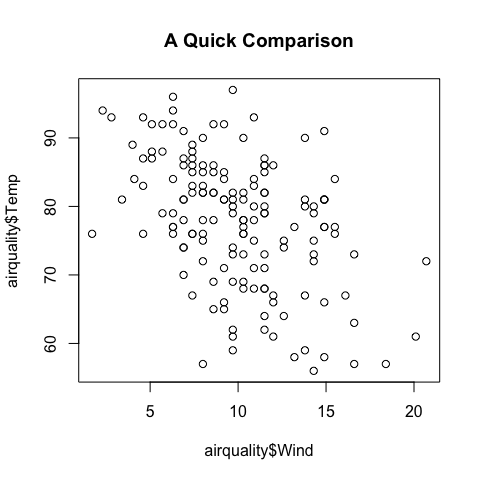
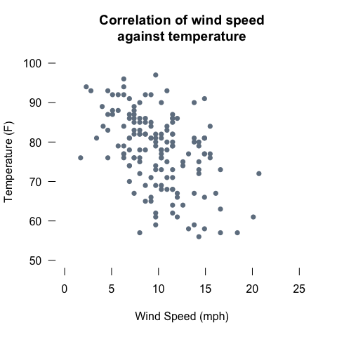
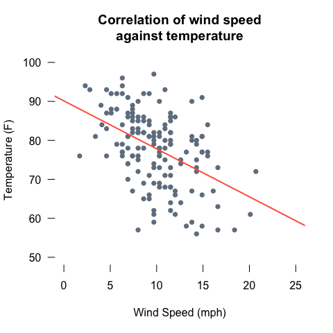

## Comparing Continuous Data

### Numbers are Fun
Continuous data are numbers, typically from taking measurements, and you can find this data type in many fields. In this entry we'll look at how you can **structure** a collection of such data, **visualise** it, and apply a **statistical test** to compare the values. 

This article is for beginners with R, and it doesn’t matter if you’re a student or a professional. You'll need an installation of R (we generally advise using RStudio as well!), and you won't need do download any external data or packages. Hopefully, you can follow along and simply run the code chunks below for yourself - and go on to perform similar analyses on your own data. 

Check our other articles for more R!

# 0. Load Some Built-In Data

* R ships with several built in data sets which we can lean on, and lots of them are great for comparing continuous data.
* We'll be using one called `airquality` - measurements from New York in 1973.
* More details can be found here: https://stat.ethz.ch/R-manual/R-devel/library/datasets/html/airquality.html
* The `data()` function is used to load a built-in dataset.


```r
data(airquality)
```

There are lots of other datasets available with R, and they're great for practicing various data science tasks. 

# 1. Examine the Data

### The Airquality Dataset

We can take a quick look at this data by applying a couple of handy functions. 


```r
head(airquality) # look at the top 5 rows of the data
```

<div data-pagedtable="false">
  <script data-pagedtable-source type="application/json">
{"columns":[{"label":[""],"name":["_rn_"],"type":[""],"align":["left"]},{"label":["Ozone"],"name":[1],"type":["int"],"align":["right"]},{"label":["Solar.R"],"name":[2],"type":["int"],"align":["right"]},{"label":["Wind"],"name":[3],"type":["dbl"],"align":["right"]},{"label":["Temp"],"name":[4],"type":["int"],"align":["right"]},{"label":["Month"],"name":[5],"type":["int"],"align":["right"]},{"label":["Day"],"name":[6],"type":["int"],"align":["right"]}],"data":[{"1":"41","2":"190","3":"7.4","4":"67","5":"5","6":"1","_rn_":"1"},{"1":"36","2":"118","3":"8.0","4":"72","5":"5","6":"2","_rn_":"2"},{"1":"12","2":"149","3":"12.6","4":"74","5":"5","6":"3","_rn_":"3"},{"1":"18","2":"313","3":"11.5","4":"62","5":"5","6":"4","_rn_":"4"},{"1":"NA","2":"NA","3":"14.3","4":"56","5":"5","6":"5","_rn_":"5"},{"1":"28","2":"NA","3":"14.9","4":"66","5":"5","6":"6","_rn_":"6"}],"options":{"columns":{"min":{},"max":[10]},"rows":{"min":[10],"max":[10]},"pages":{}}}
  </script>
</div>

```r
str(airquality) # how is this data structured
```

```
## 'data.frame':	153 obs. of  6 variables:
##  $ Ozone  : int  41 36 12 18 NA 28 23 19 8 NA ...
##  $ Solar.R: int  190 118 149 313 NA NA 299 99 19 194 ...
##  $ Wind   : num  7.4 8 12.6 11.5 14.3 14.9 8.6 13.8 20.1 8.6 ...
##  $ Temp   : int  67 72 74 62 56 66 65 59 61 69 ...
##  $ Month  : int  5 5 5 5 5 5 5 5 5 5 ...
##  $ Day    : int  1 2 3 4 5 6 7 8 9 10 ...
```

We can see that this is a `data.frame` object, with a number of data columns.
The measurements we are interested in are the first four columns, which describe: 

* mean ozone readings 
* solar radiation
* average wind speed
* maximum daily temperature

The final two columns detail when the measurements were collected.

In case you're interested in individual stats for each variable, the `summary()` function enables us to easily explore some summary statistics for these data.

```r
summary(airquality)
```

```
##      Ozone           Solar.R           Wind             Temp      
##  Min.   :  1.00   Min.   :  7.0   Min.   : 1.700   Min.   :56.00  
##  1st Qu.: 18.00   1st Qu.:115.8   1st Qu.: 7.400   1st Qu.:72.00  
##  Median : 31.50   Median :205.0   Median : 9.700   Median :79.00  
##  Mean   : 42.13   Mean   :185.9   Mean   : 9.958   Mean   :77.88  
##  3rd Qu.: 63.25   3rd Qu.:258.8   3rd Qu.:11.500   3rd Qu.:85.00  
##  Max.   :168.00   Max.   :334.0   Max.   :20.700   Max.   :97.00  
##  NA's   :37       NA's   :7                                       
##      Month            Day      
##  Min.   :5.000   Min.   : 1.0  
##  1st Qu.:6.000   1st Qu.: 8.0  
##  Median :7.000   Median :16.0  
##  Mean   :6.993   Mean   :15.8  
##  3rd Qu.:8.000   3rd Qu.:23.0  
##  Max.   :9.000   Max.   :31.0  
## 
```

Of note here is that we can see how the `Ozone` and `Solar.R` variables in the data have some missing values (NA's), which we will need to pay attention to later on.

# 2. Make a Basic Plot

It's often very helpful to make a quick graph to get a feel for your data. Here we can use the `plot()` function to quickly compare two variables.

```r
plot(x = airquality$Wind, # the data for the x-axis
     y = airquality$Temp, # the data for the y-axis
     main = "A Quick Comparison") # the title of the plot
```


From a quick eyeball, it looks like as wind speed increases, temperature decreases. Why not try plotting some of the other variables in the dataset?

<!-- The `plot()` function is clever, and will make multiple correlations if we ask it to. We can simply give it multiple columns, using the square bracket notation -  `[,1:4]` - and it will plot every column against *every other* column. The plot we've made already, `wind vs temp` can be found in the **3rd column, bottom row**.  -->

<!-- ```{r multiplot, fig.height=6, fig.width=6,fig.align='center'} -->
<!-- plot(airquality[,c(1:4)]) -->
<!-- ``` -->

<!-- The variables are plotted against each other, in all possible combinations - including switching which variables are on each axis. This is called a scatter plot matrix, and can be a handy way to get an idea about how your data might correlate. -->

# 3. Tweak the Plot to Your Liking

Customising your visualisations is part of the fun of data science. We can, of course, adjust the scatter plot we've made already to make it fit in with any style.

Here are some possible alterations - note the removal of the default axis and the separate use of the `axis()` function for the x- and y-axes. 

```r
plot(x = airquality$Wind, # the data for the x-axis
     y = airquality$Temp, # the data for the y-axis
     xlim = c(0,25), # set the x-axis limits
     ylim = c(50,100), # set the y-axis limits
     xlab = "Wind Speed (mph)", # name the x-axis,
     ylab = "Temperature (F)", # name the y-axis,
     pch = 16, # shape of the points 
     col = "slategrey", # colour for the points
     axes = FALSE, # we will edit the axis a little ourselves
     main = "Correlation of wind speed\nagainst temperature") # the title of the plot
axis(1,seq(0,25,5),col = NA, col.ticks = 1) # design the x-axis specifically
axis(2,seq(50,100,10),las=1,col = NA, col.ticks = 1) # design the y-axis specifically
```




# 4. Do a Statistical Test

These variables can be easily compared to each other with a correlation test, using the `cor()` function.

```r
cor(x = airquality$Wind, y = airquality$Temp)
```

```
## [1] -0.4579879
```
By default, this function calculates the Pearson's *r* value, which measures a linear association between two variables, and ranges between -1 and 1.

* A 1 would be a perfect 'positive' correlation, indicating that as the x-axis variable increases, so does the y-axis variable
* Values closer to 0 indicate a poor or non-existant correlation.
* A value of -1 indicates a perfect 'negative' correlation, with the x-axis variable increasing and the y-axis variable decreasing. 

The `-0.4579879` above, therefore, suggests a moderate negative correlation, which seems reasonable when we look at the plot. As wind speed increases, recorded temperature decreases - but it's not a perfect correlation.

Incidentally, we could use a different type of *correlation coefficient* - such as Spearman's, by changing the code a little.


```r
cor(x = airquality$Wind, y = airquality$Temp, method="spearman")
```

```
## [1] -0.4465408
```

# 5. Plot a Straight Line

These data seem to have some correlation, and it'd be good to visualise that. In fact, they look linear - we could probably summarise that with a straight line.

We can calculate a 'linear regression' (or 'linear model'), which will let us both quantify the relationship a bit more between the variables, and give us the information needed to plot a straight line onto the graph. Saving it into a variable (`temp_wind_line`) will be useful later.


```r
temp_wind_line = lm(formula = Temp ~ Wind, # y-axis variable ~ x-axis variable
   data=airquality) # where are these variables found
summary(temp_wind_line) # 
```

```
## 
## Call:
## lm(formula = Temp ~ Wind, data = airquality)
## 
## Residuals:
##     Min      1Q  Median      3Q     Max 
## -23.291  -5.723   1.709   6.016  19.199 
## 
## Coefficients:
##             Estimate Std. Error t value Pr(>|t|)    
## (Intercept)  90.1349     2.0522  43.921  < 2e-16 ***
## Wind         -1.2305     0.1944  -6.331 2.64e-09 ***
## ---
## Signif. codes:  0 '***' 0.001 '**' 0.01 '*' 0.05 '.' 0.1 ' ' 1
## 
## Residual standard error: 8.442 on 151 degrees of freedom
## Multiple R-squared:  0.2098,	Adjusted R-squared:  0.2045 
## F-statistic: 40.08 on 1 and 151 DF,  p-value: 2.642e-09
```
Using a 'formula' in a function like this will be familiar if you've read our other article on box plots - the thing to remember is that the dependent variable comes first, and in this case the dependent variable is Temperature - the one on the y-axis. 

[insert something here]


```r
plot(x = airquality$Wind, # the data for the x-axis
     y = airquality$Temp, # the data for the y-axis
     xlim = c(0,25), # set the x-axis limits
     ylim = c(50,100), # set the y-axis limits
     xlab = "Wind Speed (mph)", # name the x-axis,
     ylab = "Temperature (F)", # name the y-axis,
     pch = 16, # shape of the points 
     col = "slategrey", # colour for the points
     axes = FALSE, # we will edit the axis a little ourselves
     main = "Correlation of wind speed\nagainst temperature") # the title of the plot
axis(1,seq(0,25,5),col = NA, col.ticks = 1) # design the x-axis specifically
axis(2,seq(50,100,10),las=1,col = NA, col.ticks = 1) # design the y-axis specifically

abline(temp_wind_line, lwd=2,col="tomato")
```


